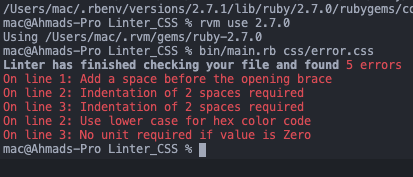

# Ruby Capstone (CSS Linter)

[](https://github.com/ahmadchata/Linter_CSS/tree/feature_linters)
[](https://github.com/ahmadchata/Linter_CSS/issues)
[](https://github.com/ahmadchata/Linter_CSS/pulls)
[](https://github.com/ahmadchata)
[](https://twitter.com/ahmadchata)
[](https://www.linkedin.com/in/ahmad-chata-957b9b51/)

## Content

<a text-align="center" href="#about">About</a>&nbsp;&nbsp;&nbsp;|&nbsp;&nbsp;&nbsp;
<a href="#rules">Rules</a>&nbsp;&nbsp;&nbsp;|&nbsp;&nbsp;&nbsp;
<a href="#ins">Installing</a>&nbsp;&nbsp;&nbsp;|&nbsp;&nbsp;&nbsp;
<a href="#set">Setup</a>&nbsp;&nbsp;&nbsp;|&nbsp;&nbsp;&nbsp;
<a href="#with">Built with</a>&nbsp;&nbsp;&nbsp;|&nbsp;&nbsp;&nbsp;
<a href="#use">Using Linter</a>&nbsp;&nbsp;&nbsp;|&nbsp;&nbsp;&nbsp;
<a href="#test">Testing</a>&nbsp;&nbsp;&nbsp;|&nbsp;&nbsp;&nbsp;
<a href="#author">Author</a>

## About <a name = "about"></a>

This project is a CSS Linter, It checks for errors in CSS files

## Rules <a name = "rules"></a>
<h4>The Style rules created are listed below:</h4>

## Space before opening brace
- Checks if there's a space before the opening brace

 ### good

 ```css
 .test {
    background: blue;
 }
 ```
 ### bad

 ```css
 .test{
    background: blue;
 }
 ```
 ## Block Indentation
 - Checks if there's 2 spaces indentation in a block

 ### good

 ```css
 .test {
    background: blue;
 }
 ```
 ### bad

 ```css
 .test {
background: blue;
 }
 ```
 ## Lower case for hex colors
 - Checks if the hex code is in lower case

 ### good

 ```css
 .test {
    background: #fff;
 }
 ```
 ### bad

 ```css
 .test {
    background: #FFF;
 }
 ```
 ## Empty Block
 - Checks if the block is empty

 ### good

 ```css
 .test {
    background: blue;
 }
 ```
 ### bad

 ```css
 .test {
 }
 ```
 ## No unit for Zero
 - Checks if there's no unit for 0 value

 ### good

 ```css
 .test {
    background: blue;
    padding: 0;
 }
 ```
 ### bad

 ```css
 .test {
    background: blue;
    padding: 0px;
 }
 ```
## 📸 Screenshot
- 


## 📹 Video description<a name = "vid"></a>

- [Video Link](https://www.loom.com/share/0a7c81ad0f0a4cd18749c02529d01b8b)


## 🔧 Built with<a name = "with"></a>

- Ruby
- RSpec (Testing)

## 🔨 Setup <a name = "set"></a>

- Fork the repo to your remote repository.
- Clone or download the repository to a local directory on your computer.

## 🛠 Installing <a name = "ins"></a>

- Ruby must be installed on machine.
- run `bundle install` to install the dependencies for the project

## 🛠 Using the linter <a name = "use"></a>

- cd into the project directory
- run `bin/main.rb <target_file>`
- Example is `bin/main.rb css/error.css` to check the error.css file

## 🛠 Testing <a name = "test"></a>

- cd into the project directory
- To test run `rspec` or `bundle exec rspec` 

## ✒️ Author <a name = "author"></a>

👤 **Ahmad Chata**

- Github: [ahmadchata](https://github.com/ahmadchata)
- Twitter: [ahmadchata](https://twitter.com/ahmadchata)
- Linkedin: [Ahmad Chata](https://www.linkedin.com/in/ahmad-chata-957b9b51/)

## 🤝 Contributing

Contributions, issues and feature requests are welcome!

Feel free to check the [issues page](https://github.com/ahmadchata/Linter_CSS/issues).

## 👍 Show your support

Give a ⭐️ if you like this project!

## :clap: Acknowledgements

- Microverse.